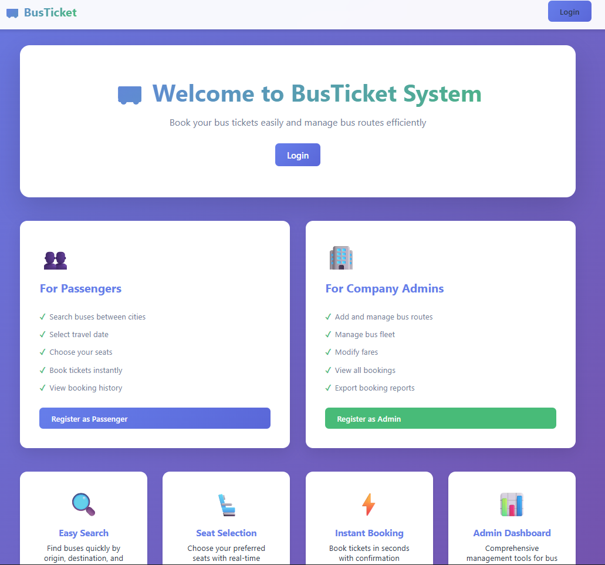
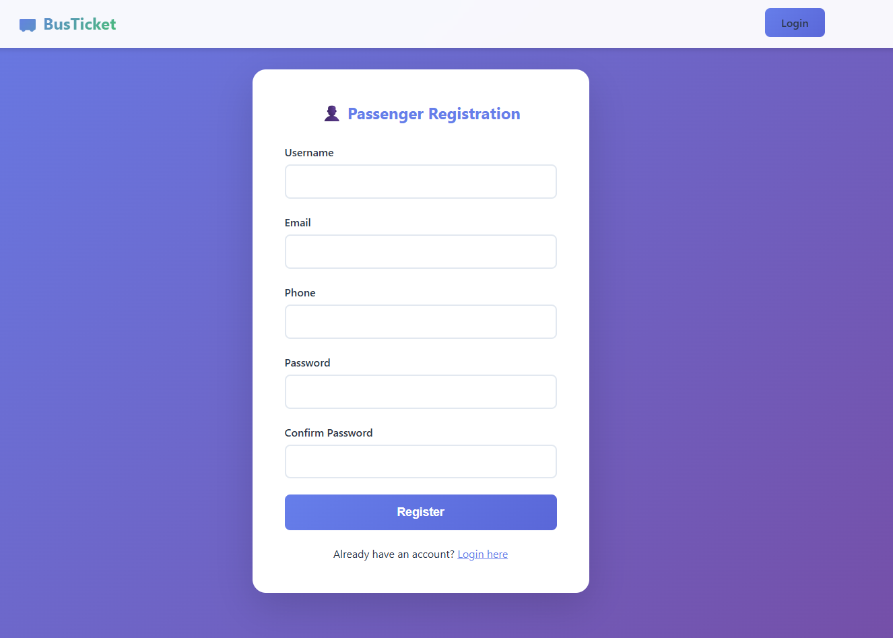
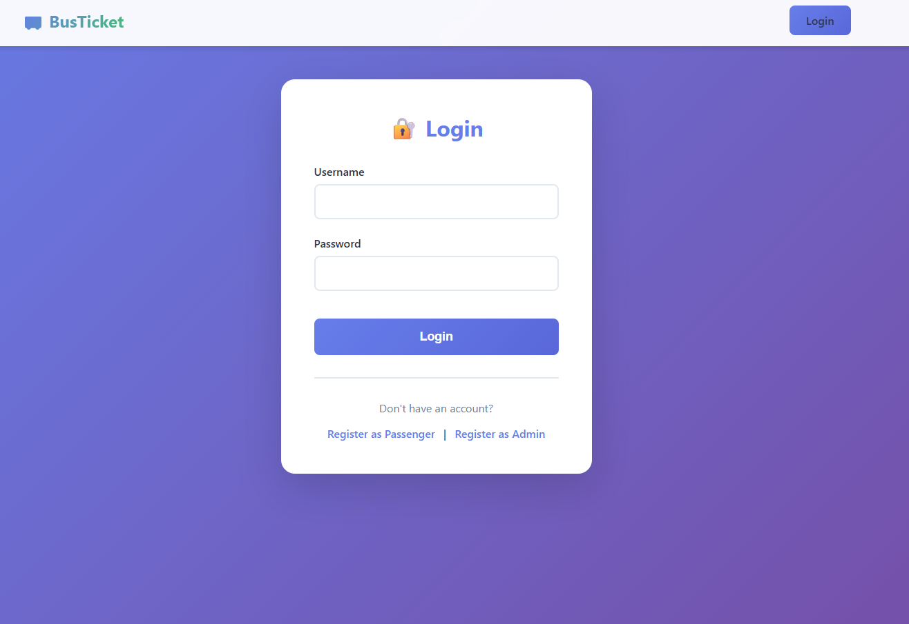
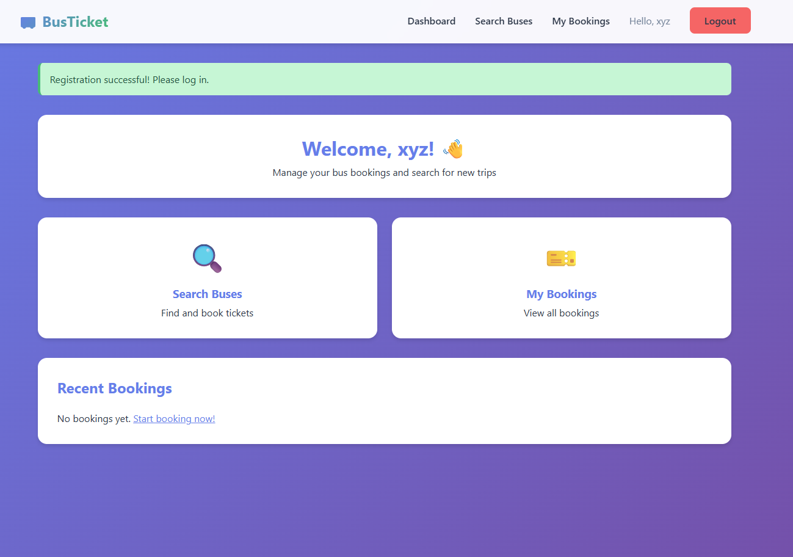
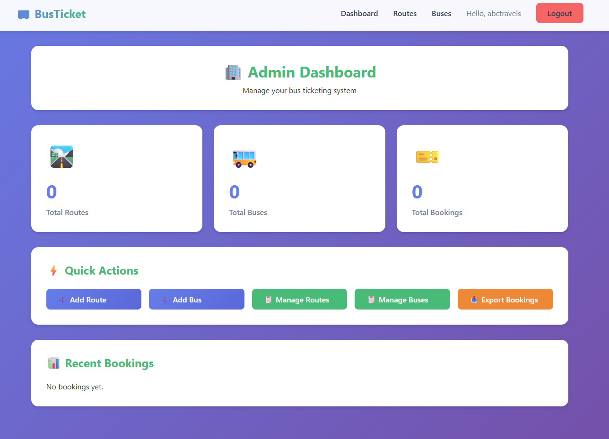

# 🚌 BusTicket – Online Bus Ticket Booking System

BusTicket is a full-stack web application built using Flask that allows passengers to search buses, book tickets, and manage bookings, while providing administrators with tools to manage routes, buses, and export booking reports.

This project demonstrates practical experience in backend development, authentication, role-based access control, database management, and UI integration.

---

## 🚀 Features

### 👤 Passenger Features
- User registration and login  
- Search buses by origin, destination, and travel date  
- View available seats in real time  
- Select seats and book tickets  
- View booking history  
- Cancel bookings  

### 🧑‍💼 Admin Features
- Admin registration (secured with admin code)  
- Add, edit, and delete bus routes  
- Add, edit, and delete buses  
- Manage fares and schedules  
- View all bookings  
- Export booking reports as CSV  
- Admin dashboard with summary metrics  

---

## 🛠 Tech Stack

- **Backend:** Flask (Python)  
- **Frontend:** HTML, CSS, Bootstrap  
- **Database:** SQLite (via SQLAlchemy ORM)  
- **Authentication:** Flask-Login  
- **Forms & Validation:** Flask-WTF  
- **Other Tools:** Werkzeug, CSV export  

---

## 📸 Screenshots

### Home Page  


### Passenger Registration  


### Login Page  


### Passenger Dashboard  


### Admin Dashboard  


---

## ▶️ How to Run This Project Locally

1. Clone the Repository
```bash
git clone https://github.com/yourusername/online-ticketing-system.git
```
2. Navigate into project folder:
  ```bash
   cd Online-Ticketing-System
  ```
3. Create a Python virtual environment:
  ```bash
  python -m venv venv
  source venv/bin/activate   # macOS / Linux
  venv\Scripts\activate      # Windows
  ```
5. Install required libraries
  ```bash 
  pip install -r requirements.txt
  ```
6.Configure Environment Variables

Create a `.env` file in the project root directory and add the following:

```text
SECRET_KEY=your_secret_key_here
ADMIN_CODE=ADMIN2024
DATABASE_URL=sqlite:///bus_ticket.db
```
7.Run the application
 ```bash 
  python app.py
  ```
8.Open in browser
```bash
  http://localhost:5000/
 ```
